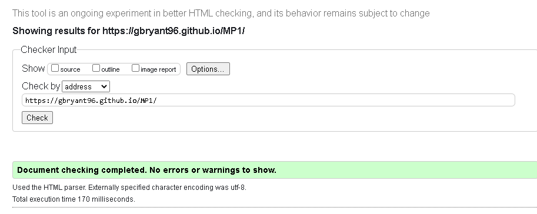
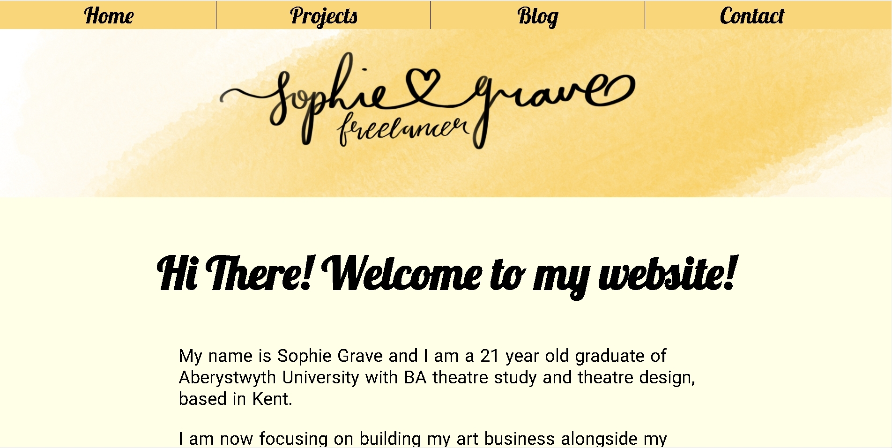
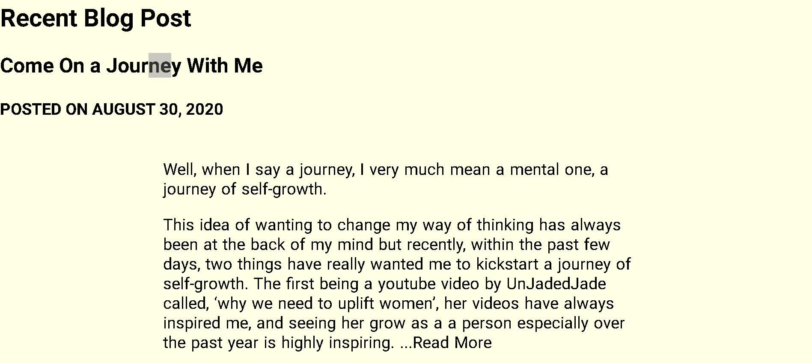
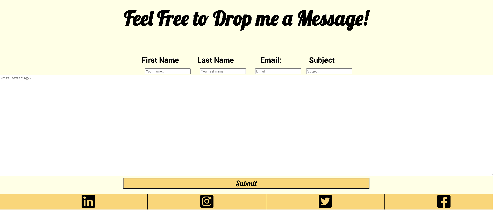
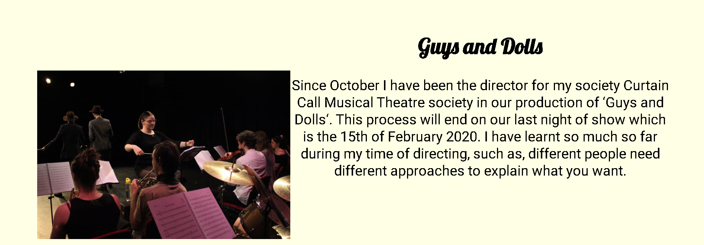
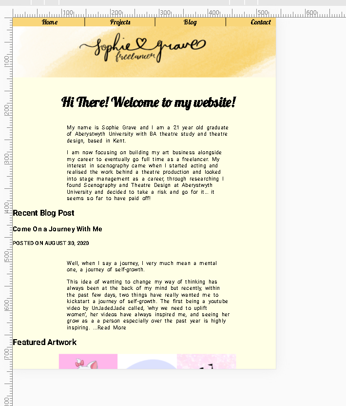

  
# <u>Milestone Project 1 : User Centric Frontend Development</u> 

## <u>User Stories</u>

- **First time visitor goals**

  - As a first time visitor, I want to feel welcomed by the style and design of the site
  - As a first time visitor, I want to have an understanding of the sites purpose from the homepage
  - As a first time visitor, I want to be able to easily navigate around the site

- ## **Returning visitor goals**

  -  As a returning visitor, I want to see if there has been any changes to the site since my last visit
  -  As a returning visitor, I want to be able to easily make contact via email or social media
  - As a returning customer I want to feel as though my favourite pages are easily accessible in a clear manor

- **frequent user goals**

  - As a frequent visitor, I want to easily see if there is any new posts or updates
  - As a frequent visitor, I want to be able to access the  site on all my devices regardless of screen size and resolution

## <u>Design</u>

- Colour Scheme

  - ​	The main colour scheme used are a dark yellow, black and white to match the hero image

- Typography

  -  The Lobster font is used for titles and headings to make it feel it more personal and the Roboto font was used in the bulk text to assist readability

- 

  - Imagery

  - The hero banner image was designed by Sophie to give her brand an image, the 'featured art works' are a selection of portraits by Sophie, I used one orientation of image to assist consistency  in the page layout.
  - The photographs were taken by Sophie and her peers at university to help them document their projects.

## <u>Wireframes</u>

## <u>Features</u>

- Responsive on all devices
- Interactive Buttons

This is a potfolio site for Sophie Grave, I have built this site to promote her brand and generate exposure to her work

## Technologies used

**Languages used**

- [HTML5](https://en.wikipedia.org/wiki/HTML5)
- [CSS3](https://en.wikipedia.org/wiki/CSS)

**Programs, Frameworks and Libraries used**

1. [Bootstrap 4.1.3](https://getbootstrap.com/docs/4.1/getting-started/introduction/)
   - Bootstrap was used to assist with styling and formatting of the website
2. [Google Fonts](https://fonts.google.com/)
   - Google fonts was used to import the "Lobster" and "Roboto" fonts which were used constantly throughout the project
3. [Font Awesome](https://fontawesome.com/)
   - Font Awesome was used to import the social media icons
4. [jQuery:](https://jquery.com/)
   - jQuery came with Bootstrap to make the navbar responsive but was also used for the smooth scroll function in JavaScript.
5. [Git](https://git-scm.com/)
   - Git was used for version control by utilizing the Gitpod terminal to commit to Git and Push to GitHub.
6. [GitHub](https://github.com/):
   - GitHub is used to store the projects code after being pushed from Git.
7. [Balsamiq:](https://balsamiq.com/)
   - Balsamiq was used to create the [wireframes](https://github.com/) during the design process.
8. [Typora](https://typora.io/)
   - I used Typora to type my readme before adding it to my repository

## Testing

The W3C Markup Validator and W3C CSS Validator Services were used to validate every page of the project to ensure there were no syntax errors in the project.

- [W3C Markup Validator](https://jigsaw.w3.org/css-validator/#validate_by_uri) - [Results](http://jigsaw.w3.org/css-validator/validator?uri=https%3A%2F%2Fgbryant96.github.io%2FMP1%2F&profile=css3svg&usermedium=all&warning=1&vextwarning=)
- [W3C html Validator](https://validator.w3.org/)

### Testing user stories

**First time visitor goals**

- As a first time visitor, I want to feel welcomed by the style and design of the site
- I kept the style clear and used soft, light colours to evoke positive emotion
- As a first time visitor, I want to have an understanding of the sites purpose from the homepage
- As a first time visitor, I want to be able to easily navigate around the site

## **Returning visitor goals**

-  As a returning visitor, I want to see if there has been any changes to the site since my last visit

The "recent blog post" give the user immediate updates as soon as the accsess the site

-  As a returning visitor, I want to be able to easily make contact via email or social media

the "contact" page gives users an easy method to make contact and the footer nav is direct links to all of the relevant social media pages

- As a returning visitor I want to feel as though my favourite pages are easily accessible in a clear manor

The ease of use the site provides ensures visitors can find the page they're looking for with ease
**frequent user goals**

- As a frequent visitor, I want to easily see if there is any new posts or updates

The homepage has recent blog posts and featured art, allowing visitors to easily check if there is any new content

- As a frequent visitor, I want to be able to access the  site on all my devices regardless of screen size and resolution

the site is responsive allowing access on mobile and tablets

## Further Testing

- The Website was tested in Google Chrome, Microsoft edge and Safari Browsers
- The Website was tested on Desktop, MacBook, iPhone 7+, iPhone XS, Google pixel 2, Razer 2,
- Tested all internal and external links to ensure functionality
- Friends were asked to review the site and documentation to point out any issues

## known bugs and issues

- there is a slight amount of horizontal overhang on a few devices

- on longer screens, there is an amount of empty space below the footer

## Deployment

### GitHub Pages

The project was deployed to GitHub Pages using the following steps...

1. Log in to GitHub and locate the [GitHub Repository](https://github.com/)
2. At the top of the Repository (not top of page), locate the "Settings" Button on the menu.
   - Alternatively Click [Here](https://raw.githubusercontent.com/) for a GIF demonstrating the process starting from Step 2.
3. Scroll down the Settings page until you locate the "GitHub Pages" Section.
4. Under "Source", click the dropdown called "None" and select "Master Branch".
5. The page will automatically refresh.
6. Scroll back down through the page to locate the now published site [link](https://github.com/) in the "GitHub Pages" section.

## Credits

### Code

- [Bootstrap4](https://getbootstrap.com/docs/4.4/getting-started/introduction/):
  -  Bootstrap Library used throughout the project mainly to make site responsive using the Bootstrap Grid System.
- [W3Schools](https://www.w3schools.com/):
  - Used for code snippets, mostly for my contact form. and as a constant reference point during develpment

### Content

- All content was written by Sophie Grave

### Media

- All Images were created by Sophie Grave.

### Acknowledgements

- My Mentor for continuous helpful feedback.

- Tutor support at Code Institute for their support.

- The Slack Community for their support and imput

- Margaret Burns at FutureCoders. A personal Friend who supported me throughout

- Sophie Grave for allowing me to use her content and art
